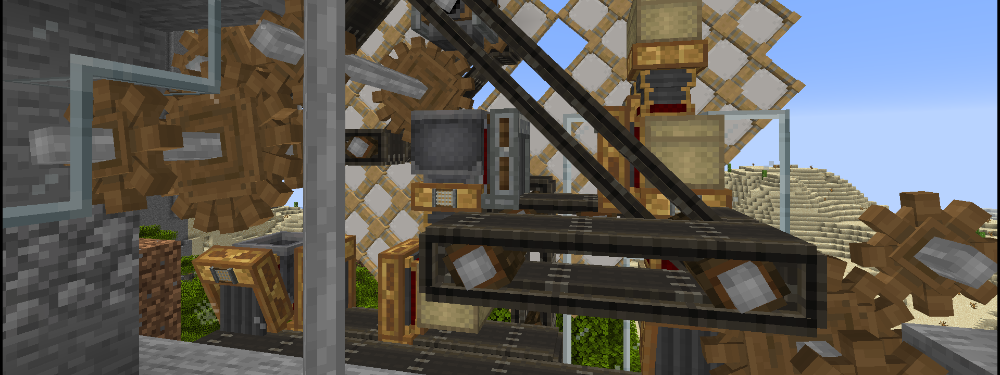

# copy's Extraordinary Pack for Cuties

A Minecraft 1.16.5 Forge modpack which focuses around the mods **[Create]**, **[Tetra]** and **[Quark]** as a Vanilla+ like experience. Other mods bring many improvements, additions and tweaks to many aspects of the game, but we try to keep down their numbers. Most notably, the pack lacks biome, magic and traditional tech mods.

[Create]: https://www.curseforge.com/minecraft/mc-mods/create
[Tetra]:  https://www.curseforge.com/minecraft/mc-mods/tetra
[Quark]:  https://www.curseforge.com/minecraft/mc-mods/quark

If you're interested in which mods we're using (minus dependencies), see [MODLIST.md](MODLIST.md).  
For a detailed list of configuration and datapack changes we made, see [CHANGES.md](CHANGES.md).

## Download and Installation

We use the modpack development tool [Voodoo] for easier development, version control, management of mods, keeping them up-to-date, and to have a self-updating [MultiMC] instance for our players.

Simply drag this link >> [`cepfc.zip`](https://copy.mcft.net/mc/cepfc/cepfc.zip) << and drop it into the main [MultiMC] window to create a new instance. (You can also click "Add Instance" and select "Import from zip" and copy this link into the textbox.) When you first attempt to launch the instance, you will receive an error - just launch again! It will then ask you which optional mods you want and download everything for you before starting the game.

[Voodoo]:  https://github.com/DaemonicLabs/Voodoo
[MultiMC]: https://multimc.org/
