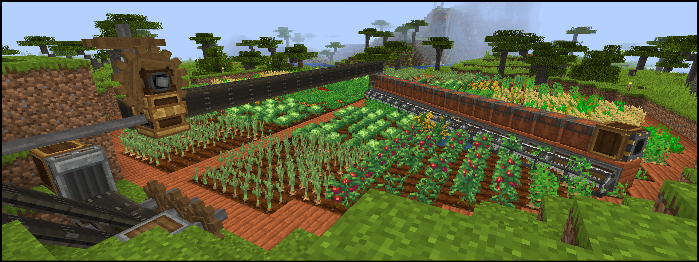

# copy's Extraordinary Pack for Cuties

A Minecraft 1.16.5 Forge modpack which focuses around the mods **[Create]**, **[Tetra]** and **[Quark]** as a Vanilla+ like experience. Other mods bring many improvements, additions and tweaks to many aspects of the game, but we try to keep down their numbers. Most notably, the pack lacks biome, magic and traditional tech mods.

[Create]: https://www.curseforge.com/minecraft/mc-mods/create
[Tetra]:  https://www.curseforge.com/minecraft/mc-mods/tetra
[Quark]:  https://www.curseforge.com/minecraft/mc-mods/quark



If you're interested in which mods we're using (minus dependencies), see [MODLIST.md](MODLIST.md).  
For a detailed list of configuration and datapack changes we made, see [CHANGES.md](CHANGES.md).  
And if you'd like to look at the changes from version to version, see [CHANGELOG.md](CHANGELOG.md).

## Download and Installation

Simply drag this link >> [`cepfc.zip`](https://copy.mcft.net/mc/cepfc/cepfc.zip) << and drop it into the main [MultiMC] window to create a new instance. (You can also click "Add Instance" and select "Import from zip" and copy this link into the textbox.) When you first attempt to launch the instance, you will receive an error - just launch again! It will then ask you which optional mods you want and download everything for you before starting the game.

## Development

We use the modpack development tool [Voodoo] for easier development, version control, management of mods, keeping them up-to-date, and to have a self-updating [MultiMC] instance for our players.

```sh
# Update all mods to latest and compile the modpack.
./voodoo compile cepfc/master.voodoo.json5

# Just compile the modpack. Needed when files in `cepfc/src/` are updated.
./voodoo compile --no-mod-updates cepfc/master.voodoo.json5

# Package up files for distribution.
./voodoo package cepfc/modpack.meta.json5 voodoo mmc-voodoo mmc-local server
# `_upload/voodoo/` has files needed for automatic updating of MultiMC instances.
# `_upload/multimc-voodoo/` has .zip files used to create auto-updating MultiMC instances.
# `_upload/multimc-local/cepfc_local.zip` is used to create a MultiMC instance for local testing.
# `_upload/server/` has folders used to setup a server.

# Update the Voodoo version in `wrapper/wrapper.properties` to latest.
./voodoo update
```

[Voodoo]:  https://github.com/DaemonicLabs/Voodoo
[MultiMC]: https://multimc.org/
